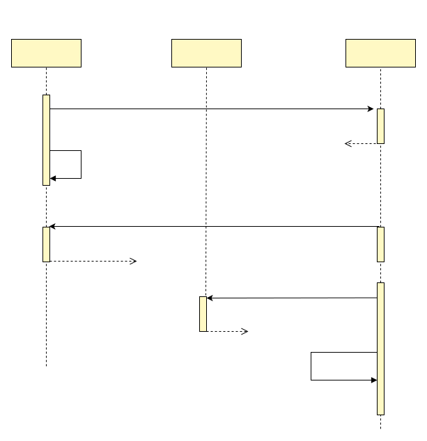

# Two-phase message example
This article will present a complete 2-phase messaging example to give the reader an accurate understanding of 2-phase messaging type transactions

## Business Scenario
An inter-bank transfer is a typical distributed transaction scenario, where A needs to transfer money across a bank to B. Suppose that only the transfer from A may fail and the transfer to B is able to eventually succeed

## Two-Phase Messaging

Two-stage messaging is a transaction model pioneered by dtm to replace the existing solutions of local transaction tables and transactional messages. It ensures that local transaction commits and global transaction commits are "atomic" and is suitable for solving distributed transaction scenarios that do not require rollback. Let's take a look at 2-phase messaging and see how it solves this business scenario.

## Core business

First we create the account balance table.
``` Go
CREATE TABLE dtm_busi.`user_account` (
  `id` int(11) AUTO_INCREMENT PRIMARY KEY,
  `user_id` int(11) not NULL UNIQUE ,
  `balance` decimal(10,2) NOT NULL DEFAULT '0.00',
  `trading_balance` decimal(10,2) NOT NULL DEFAULT '0.00',
  `create_time` datetime DEFAULT now(),
  `update_time` datetime DEFAULT now()
);
```

Then write the core business code to adjust the user's account balance

``` Go
func SagaAdjustBalance(db dtmcli.DB, uid int, amount int, result string) error {
	_, err := dtmimp.DBExec(db, "update dtm_busi.user_account set balance = balance + ? where user_id = ?" , amount, uid)
	return err
}
```

Then write the specific handler function

``` GO
app.POST(BusiAPI+"/SagaBTransIn", dtmutil.WrapHandler2(func(c *gin.Context) interface{} {
  barrier := MustBarrierFromGin(c)
  return barrier.Call(txGet(), func(tx *sql.Tx) error {
    return SagaAdjustBalance(tx, TransInUID, reqFrom(c).Amount, "")
  })
}))
```

The core logic of all these processing functions is to adjust the balance. The `barrier.Call` here is mainly used to handle idempotency and ensure that repeated calls do not adjust the balance multiple times, see [exceptions and solutions](../practice/barrier) for details.

## Two-phase message transactions

At this point the individual subtransaction handler functions are OK, then it's time to open the 2-phase message transaction and make the business call
``` GO
  msg := dtmcli.NewMsg(DtmServer, dtmcli.MustGenGid(DtmServer)).
    Add(busi.Busi+"/SagaBTransIn", &TransReq{ Amount: 30 })
  err := msg.DoAndSubmitDB(busi.Busi+"/QueryPreparedB", dbGet(), func(tx *sql.Tx) error {
    return busi.SagaAdjustBalance(tx, busi.TransOutUID, -req.Amount)
  })
```

This code ensures that the business commit and global transaction commit in DoAndSubmitDB are "atomic", ensuring that both TransOut and TransIn succeed or fail at the same time. The first parameter in DoAndSubmitDB is the checkback URL, which is the following code.
``` go
app.GET(BusiAPI+"/QueryPreparedB", dtmutil.WrapHandler2(func(c *gin.Context) interface{} {
  bb := MustBarrierFromGin(c)
  return bb.QueryPrepared(dbGet())
}))
```

At this point, a complete two-stage message distributed transaction is written.

## Run the example
If you want to run a successful example in its entirety, the steps are as follows.
1. run dtm
``` bash
git clone https://github.com/dtm-labs/dtm && cd dtm
go run main.go
```

2. Run the example

``` bash
git clone https://github.com/dtm-labs/dtm-examples && cd dtm-examples
go run main.go http_msg_doAndCommit
```

## How to guarantee atomicity

How can a 2-phase message guarantee that both the local transaction and the global transaction will either both succeed or both fail? What happens if the process crashes after the local transaction is committed and before the global transaction is committed? The following timing diagram provides a good explanation of how two-phase messages handle this problem.



The checkback processing logic in the diagram is already done automatically by dtm, the user just needs to paste the above code

## Summary

This article gives a complete 2-phase message transaction solution. You can use it to solve your real problems with a few simple modifications to this example

A detail desciption of 2-phase message can be found here [MSG](../practice/msg)
