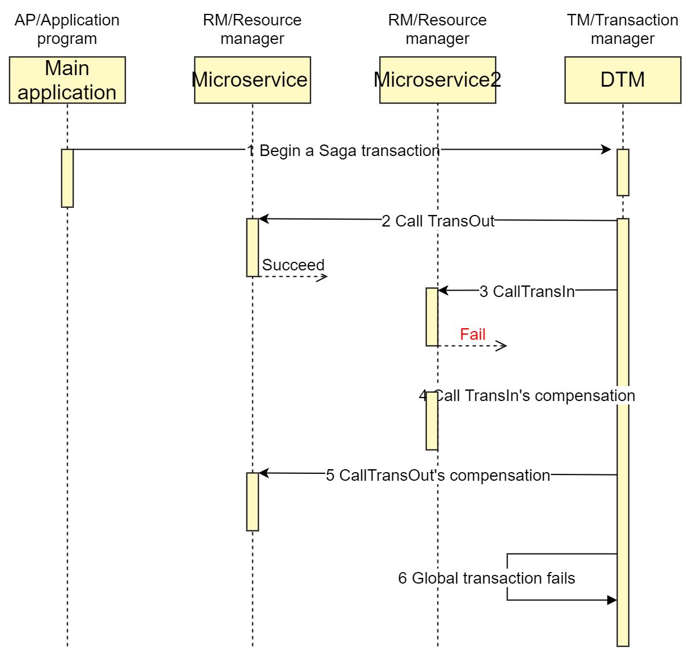

# SAGA Example
This article will present a complete SAGA example to give the reader an accurate understanding of SAGA transactions

## Business Scenario
An inter-bank transfer is a typical distributed transaction scenario, where A needs to transfer money across a bank to B. The hypothetical requirement scenario is that both the transfer from A and the transfer to B may succeed and fail, and that both the withdraw and the deposit need to succeed or fail in the end

## SAGA

Saga is a distributed transaction mode mentioned in this database paper [SAGAS](https://www.cs.cornell.edu/andru/cs711/2002fa/reading/sagas.pdf). The core idea is to split long transactions into multiple short local transactions, which are coordinated by the Saga transaction coordinator, so that if each local transaction completes successfully then it completes normally, and if a step fails then the compensating operations are invoked one at a time in reverse order.

## Core operations

For the example of the bank transfer we are going to perform, we will do the transfer in and out in the forward operation and the opposite adjustment in the compensation operation.

First we create the account balance table.
``` Go
CREATE TABLE dtm_busi.`user_account` (
  `id` int(11) AUTO_INCREMENT PRIMARY KEY,
  `user_id` int(11) not NULL UNIQUE ,
  `balance` decimal(10,2) NOT NULL DEFAULT '0.00',
  `trading_balance` decimal(10,2) NOT NULL DEFAULT '0.00',
  `create_time` datetime DEFAULT now(),
  `update_time` datetime DEFAULT now()
);
```

Then write the core business code to adjust the user's account balance

``` Go
func SagaAdjustBalance(db dtmcli.DB, uid int, amount int, result string) error {
	_, err := dtmimp.DBExec(db, "update dtm_busi.user_account set balance = balance + ? where user_id = ?" , amount, uid)
	return err
}
```

Then write the specific processing function for the forward/compensation operation

``` GO
app.POST(BusiAPI+"/SagaBTransIn", dtmutil.WrapHandler2(func(c *gin.Context) interface{} {
  barrier := MustBarrierFromGin(c)
  return barrier.Call(txGet(), func(tx *sql.Tx) error {
    return SagaAdjustBalance(tx, TransInUID, reqFrom(c).Amount, "")
  })
}))
app.POST(BusiAPI+"/SagaBTransInCom", dtmutil.WrapHandler2(func(c *gin.Context) interface{} {
  barrier := MustBarrierFromGin(c)
  return barrier.Call(txGet(), func(tx *sql.Tx) error {
    return SagaAdjustBalance(tx, TransInUID, -reqFrom(c).Amount, "")
  })
}))
app.POST(BusiAPI+"/SagaBTransOut", dtmutil.WrapHandler2(func(c *gin.Context) interface{} {
  barrier := MustBarrierFromGin(c)
  return barrier.Call(txGet(), func(tx *sql.Tx) error {
    return SagaAdjustBalance(tx, TransOutUID, -reqFrom(c).Amount, "")
  })
}))
app.POST(BusiAPI+"/SagaBTransOutCom", dtmutil.WrapHandler2(func(c *gin.Context) interface{} {
  barrier := MustBarrierFromGin(c)
  return barrier.Call(txGet(), func(tx *sql.Tx) error {
    return SagaAdjustBalance(tx, TransOutUID, reqFrom(c).Amount, "")
  })
}))
```

The core logic of these processing functions is to adjust the balance, for which the role of `barrier.Call` will be explained in detail later

## SAGA transaction

The processing functions for each subtransaction are now OK, then it's time to open the SAGA transaction and make the branch call
``` GO
	req := &gin.H{"amount": 30} // load of microservice
	// DtmServer is the address of the DTM service
	saga := dtmcli.NewSaga(DtmServer, dtmcli.MustGenGid(DtmServer)).
		// Add a child transaction of TransOut with url: qsBusi+"/TransOut" for the forward operation and url: qsBusi+"/TransOutCom" for the reverse operation
		Add(qsBusi+"/SagaBTransOut", qsBusi+"/SagaBTransOutCom", req).
		// Add a subtransaction of TransIn with url: qsBusi+"/TransOut" for the forward action and url: qsBusi+"/TransInCom" for the reverse action
		Add(qsBusi+"/SagaBTransIn", qsBusi+"/SagaBTransInCom", req)
	// commit saga transaction, dtm will complete all subtransactions/roll back all subtransactions
	err := saga.Submit()

```

At this point, a complete SAGA distributed transaction is finished.

## Run
If you want to run a successful example in its entirety, the steps are as follows.
1. run dtm
``` bash
git clone https://github.com/dtm-labs/dtm && cd dtm
go run main.go
```

2. Run the example

``` bash
git clone https://github.com/dtm-labs/dtm-examples && cd dtm-examples
go run main.go http_saga_barrier
```

The timing diagram is as follows.


## Handling network exceptions

Suppose a transaction committed to dtm has a transient fault when an operation is invoked. dtm will retry the incomplete operation, which requires the subtransactions of the global transaction to be idempotent. dtm framework pioneered the subtransaction barrier technique, providing the BranchBarrier tool class to help users handle idempotency easily. It provides a function `Call` that guarantees that the operation inside this function will be called at most once:
``` go
func (bb *BranchBarrier) Call(tx *sql.Tx, busiCall BarrierBusiFunc) error
```

This BranchBarrier can automatically handle not only idempotency, but also null-compensation and hanging issues, see [exceptions and solutions](../practice/barrier) for details.

## Handling rollbacks

What happens if the bank is preparing to transfer the amount to user 2 and finds that user 2's account is abnormal and returns a failure? We adjust the handler function so that the transfer operation returns a failure

``` go
app.POST(BusiAPI+"/SagaBTransIn", dtmutil.WrapHandler2(func(c *gin.Context) interface{} {
  return dtmcli.ErrFailure
}))
```

We give the timing diagram for the transaction failure interaction



Here is the thing, forward operation of TransIn branch did nothing and returned a failure, will calling compensate operation of TransIn branch at this point cause the reverse adjustment to go wrong?

Don't worry, the preceding subtransaction barrier technique ensures that the TransIn failure is compensated as a null operation if it occurs before the commit, and  is compensated to do opposite adjustment if it occurs after the commit

You can change the TransIn that returns an error after commit.
``` Go
app.POST(BusiAPI+"/SagaBTransIn", dtmutil.WrapHandler2(func(c *gin.Context) interface{} {
  barrier := MustBarrierFromGin(c)
  barrier.Call(txGet(), func(tx *sql.Tx) error {
    return SagaAdjustBalance(tx, TransInUID, reqFrom(c).Amount, "")
  })
  return dtmcli.ErrFailure
}))
```
The final result balance will still be right, see [Exceptions and Solutions](../practice/barrier) for details.

## Summary

This article gives a complete SAGA transaction solution, a working SAGA, which you can use to solve your real problems with a few simple modifications to this example

A detail desciption of SAGA can be found here [SAGA](../practice/saga)