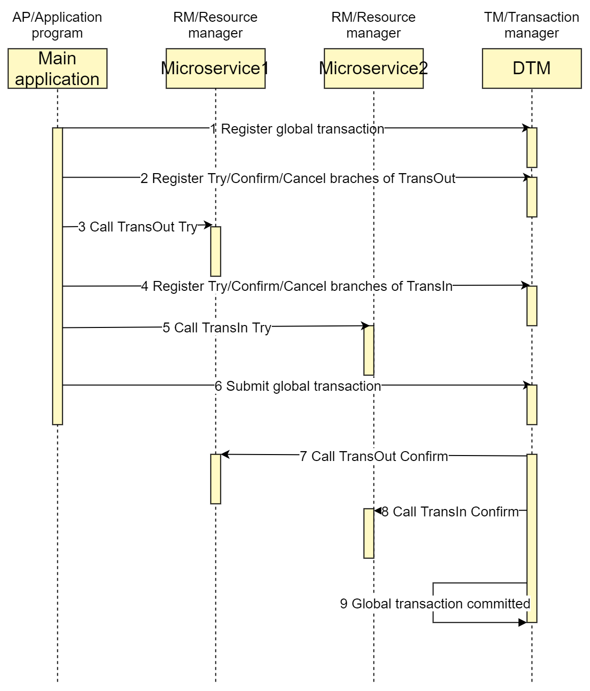
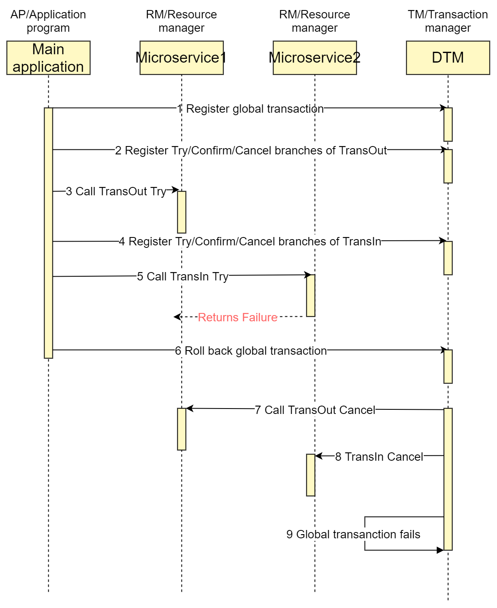

# TCC Example

This article will present a complete TCC example to give the reader an accurate understanding of TCC-type transactions

## Business Scenario
A typical distributed transaction scenario is inter-bank transfers, where A needs to transfer funds across a bank to B. The hypothetical requirement scenario is that both transfers out of A and into B may succeed and fail, and that both transfers in and out will eventually succeed or fail.

There is also a requirement that if there is a rollback, the SAGA mode will result in A discovering that its balance has been deducted, but the recipient, B, is late in receiving the balance, which will cause A great distress. The business would prefer to avoid this situation

## TCC Components
The TCC is divided into 3 phases

- Try phase: attempts to execute, completes all business checks (consistency), reserve necessary business resources.
- Confirm phase: if all branches succeed in the Try phase, then we move to the Confirm phase, where Confirm actually executes the business without any business checks, using only the business resources reserved in the Try phase
- Cancel phase: If one of the Trys in all branches fails, we go to the Cancel phase, which releases the business resources reserved in the Try phase.

If we were to perform a transaction similar to a bank interbank transfer, with TransOut and TransIn in separate microservices, a typical timing diagram for a successfully completed TCC transaction would be as follows.



## Core Operations
First we create the account balance table, where trading_balance indicates the amount that has been frozen.
````
create table if not exists dtm_busi.user_account(
  id int(11) PRIMARY KEY AUTO_INCREMENT,
  user_id int(11) UNIQUE,
  balance DECIMAL(10, 2) not null default '0',
  trading_balance DECIMAL(10, 2) not null default '0',
  create_time datetime DEFAULT now(),
  update_time datetime DEFAULT now(),
  key(create_time),
  key(update_time)
);
````

Let's write the core code first, the freeze/unfreeze funds operation will check the constraint balance+trading_balance >= 0, if the constraint is not valid, the execution fails

``` go
func tccAdjustTrading(db dtmcli.DB, uid int, amount int) error {
	affected, err := dtmimp.DBExec(db, `update dtm_busi.user_account set trading_balance=trading_balance+?
		 where user_id=? and trading_balance + ? + balance >= 0`, amount, uid, amount)
	if err == nil && affected == 0 {
		return fmt.Errorf("update error, maybe balance not enough")
	}
	return err
}

func tccAdjustBalance(db dtmcli.DB, uid int, amount int) error {
	affected, err := dtmimp.DBExec(db, `update dtm_busi.user_account set trading_balance=trading_balance-? ,
		 balance=balance+? where user_id=? `, amount, amount, uid)
	if err == nil && affected == 0 {
		return fmt.Errorf("update user_account 0 rows")
	}
	return err
}
```

Let's write the specific Try/Confirm/Cancel handler functions

``` go
app.POST(BusiAPI+"/TccBTransOutTry", dtmutil.WrapHandler2(func(c *gin.Context) interface{} {
  bb := MustBarrierFromGin(c)
  return bb.Call(txGet(), func(tx *sql.Tx) error {
    return tccAdjustTrading(tx, TransOutUID, -req.Amount)
  })
}))
app.POST(BusiAPI+"/TccBTransOutConfirm", dtmutil.WrapHandler2(func(c *gin.Context) interface{} {
  bb := MustBarrierFromGin(c)
  return bb.Call(txGet(), func(tx *sql.Tx) error {
    return tccAdjustBalance(tx, TransOutUID, -reqFrom(c).Amount)
  })
}))
app.POST(BusiAPI+"/TccBTransOutCancel", dtmutil.WrapHandler2(func(c *gin.Context) interface{} {
  bb := MustBarrierFromGin(c)
  return bb.Call(txGet(), func(tx *sql.Tx) error {
    return tccAdjustTrading(tx, TransOutUID, req.Amount)
  })
}))
app.POST(BusiAPI+"/TccBTransInTry", dtmutil.WrapHandler2(func(c *gin.Context) interface{} {
  bb := MustBarrierFromGin(c)
  return bb.Call(txGet(), func(tx *sql.Tx) error {
    return tccAdjustTrading(tx, TransInUID, req.Amount)
  })
}))
app.POST(BusiAPI+"/TccBTransOutConfirm", dtmutil.WrapHandler2(func(c *gin.Context) interface{} {
  bb := MustBarrierFromGin(c)
  return bb.Call(txGet(), func(tx *sql.Tx) error {
    return tccAdjustBalance(tx, TransInUID, reqFrom(c).Amount)
  })
}))
app.POST(BusiAPI+"/TccBTransInCancel", dtmutil.WrapHandler2(func(c *gin.Context) interface{} {
  bb := MustBarrierFromGin(c)
  return bb.Call(txGet(), func(tx *sql.Tx) error {
    return tccAdjustTrading(tx, TransInUID, -req.Amount)
  })
}))
```

The core logic of these functions is to freeze and adjust the balance, the role of `bb.Call` in this will be explained in detail later

## TCC transactions
Then the TCC transaction is created and branch calls are made

``` go
// TccGlobalTransaction will open a global transaction
_, err := dtmcli.TccGlobalTransaction(DtmServer, func(tcc *dtmcli.Tcc) (rerr error) {
  // CallBranch will register the Confirm/Cancel of the transaction branch to the global transaction, and then call Try directly
  res1, rerr := tcc.CallBranch(&TransReq{Amount: 30}, host+"/api/TccBTransOutTry", host+"/api/TccBTransOutConfirm", host+"/api/ TccBTransOutCancel"
  if err ! = nil {
    return resp, err
  }
  return tcc.CallBranch(&TransReq{Amount: 30}, host+"/api/TccBTransInTry", host+"/api/TccBTransInConfirm", host+"/api/TccBTransInCancel")
})
```

At this point, a complete TCC distributed transaction is finished.

## Run
If you want to run a successful example entirety, the steps are as follows.
1. run dtm
``` bash
git clone https://github.com/dtm-labs/dtm && cd dtm
go run main.go
```

2. Run the example

``` bash
git clone https://github.com/dtm-labs/dtm-examples && cd dtm-examples
go run main.go http_tcc_barrier
```

## Handling network exceptions

Suppose a transaction committed to dtm fails briefly at one of these steps. dtm will retry the incomplete operation, requiring the subtransactions of the global transaction to be idempotent. dtm framework pioneered the subtransaction barrier technique, providing the BranchBarrier utility class to help users handle idempotency easily. It provides a function Call which guarantees that the operation inside this function will be called at most once:
``` go
func (bb *BranchBarrier) Call(tx *sql.Tx, busiCall BarrierBusiFunc) error
```

This BranchBarrier can automatically handle not only idempotency, but also null-compensation and hanging issues, see [exceptions and solutions](../practice/barrier) for details.

### Rollback of TCC
What happens if the bank is preparing to transfer the amount to user 2 and finds that user 2's account is abnormal and returns a failure? We modify the code to simulate this situation.
``` go
app.POST(BusiAPI+"/TccBTransInTry", dtmutil.WrapHandler2(func(c *gin.Context) interface{} {
  return dtmcli.ErrFailure
}))
```
This is the timing diagram for a transaction failure interaction


The difference between this and a successful TCC is that when a child transaction returns a failure, the global transaction is subsequently rolled back, calling the Cancel operation of each child transaction to ensure that the global transaction is all rolled back.

The forward operation of TransInTry returned a failure without doing anything, at this point calling the TransInCancel compensation operation will cause the reverse adjustment to go wrong?

Don't worry, the preceding subtransaction barrier technique ensures that the TransInTry error is compensated as a null operation if it occurs before the commit, and that the compensation operation commits the data if the TransInTry error occurs after the commit.

You can change `TccBTransInTry` to
``` go
app.POST(BusiAPI+"/TccBTransInTry", dtmutil.WrapHandler2(func(c *gin.Context) interface{} {
  bb := MustBarrierFromGin(c)
  bb.Call(txGet(), func(tx *sql.Tx) error {
    return tccAdjustTrading(tx, TransInUID, req.Amount)
  })
  return dtmcli.ErrFailure
}))
```

The final result balance will still be right, see [Exceptions and Solutions](../practice/barrier) for details.

### Summary

This article gives a complete TCC transaction solution. You can use it to solve your real problems with a few simple modifications to this example

For more information on the principles of TCC, see [TCC](../practice/tcc)