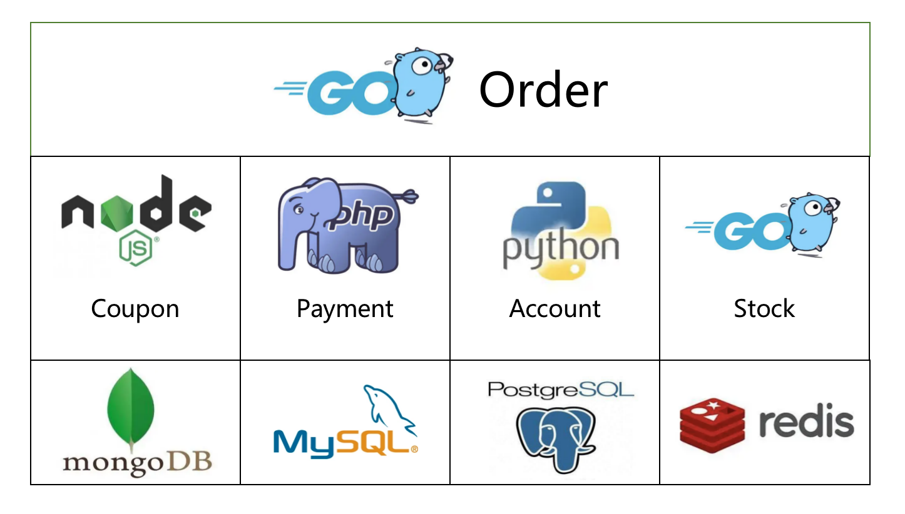

# Introduction

## What is DTM

DTM is a distributed transaction solution which provides cross-service eventually data consistency. It provides saga, tcc, xa, 2-phase message strategies for a variety of application scenarios. It also supports multiple languages and multiple store engine to form up a transaction as following picture:



Learn more behind the design of DTM in [why choose DTM](./why).

## Features

* Extremely easy to adopt
  - Support HTTP and gRPC, provide easy-to-use programing interfaces, lower substantially the barrier of getting started with distributed transactions, newcomers can adopt quickly

* Easy to use
  - Relieving developers from worrying about suspension, null compensation, idempotent transaction, and other tricky problems, the framework layer handles them all

* Language-agnostic
  - Suitable for companies with multiple-language stacks.
    Easy to write bindings for go, python, php, nodejs, ruby and other languages.

* Easy to deploy, easy to extend
  - DTM depends only on mysql, easy to deploy, cluster, and scale horizontally

* Support for multiple distributed transaction protocol
  - TCC, SAGA, XA, Transactional messages

Invited speaker at the China Database Conference. [Distributed Transaction Practice in Multi-Language Environment](http://dtcc.it168.com/yicheng.html#b9)

## Companies that adopt dtm

[Ivydad](https://ivydad.com)

[Eglass](https://epeijing.cn)

[Jiou](http://jiou.me)

[GoldenData](./start)

<a style="
    background-color:#646cff;
    font-size: 0.9em;
    color: #fff;
    margin: 0.2em 0;
    width: 200px;
    text-align: center;
    padding: 12px 24px;
    display: inline-block;
    vertical-align: middle;
    border-radius: 2em;
    font-weight: 600;
" href="../other/opensource">Comparison to Seata</a>

## start

::: tip Basics to have
This tutorial assumes that you already have basic knowledge of distributed transactions. If you are not familiar with this, first read [Theory of Distributed Transactions](../guide/theory).

This tutorial also assumes that you have some basic programming knowledge and can understand GO code in general. If you are not familiar with this, you can visit [golang](https://golang.google.cn/).
:::

### run dtm

``` bash
git clone https://github.com/dtm-labs/dtm && cd dtm
go run main.go
```

### Start the example

``` bash
git clone https://github.com/dtm-labs/dtmcli-go-sample && cd dtmcli-go-sample
go run main.go
```

In this example, a saga distributed transaction is created and then committed to dtm, with key code shown below:

``` go
	req := &gin.H{"amount": 30} // micro-service load threshold
	// DtmServer is the address of DTM micro-service
	saga := dtmcli.NewSaga(DtmServer, dtmcli.MustGenGid(DtmServer)).
		// add a TransOut subtraction，forward operation with url: qsBusi+"/TransOut", reverse compensation operation with url: qsBusi+"/TransOutCompensate"
		Add(qsBusi+"/TransOut", qsBusi+"/TransOutCompensate", req).
		// add a TransIn subtraction, forward operation with url: qsBusi+"/TransIn", reverse compensation operation with url: qsBusi+"/TransInCompensate"
		Add(qsBusi+"/TransIn", qsBusi+"/TransInCompensate", req)
	// submit the created saga transaction，dtm ensures all subtractions either complete or get revoked
	err := saga.Submit()
```

The entire transaction completes successfully eventually with the following timing diagram:


In a real business, it is possible that a sub-transaction may fail.
For example, the destination sub-account is freezed, causing the transfer to fail.
Let's modify the business code to purposely fail the forward operation of TransIn and watch what happens.

``` go
	app.POST(qsBusiAPI+"/TransIn", func(c *gin.Context) {
		c.JSON(409, "") // Status 409 for Failure. Won't be retried
	})

```

Running the example again, the whole transaction eventually fails with the following timing diagram:


Notice that in case the transfer operation fails, the TransIn and TransOut compensation branches are executed, ensuring that the final balance is the same as it was before the transfer.

## Ready to try?

We have just briefly described a complete distributed transaction, including a success, and a rollback.
Now that you should have a concrete understanding of distributed transactions in DTM, keep learning this tutorial to learn step-by-step the technical solutions and techniques for handling distributed transactions.

## Slack

You can join the [DTM slack channel here](https://join.slack.com/t/dtm-w6k9662/shared_invite/zt-vkrph4k1-eFqEFnMkbmlXqfUo5GWHWw)
