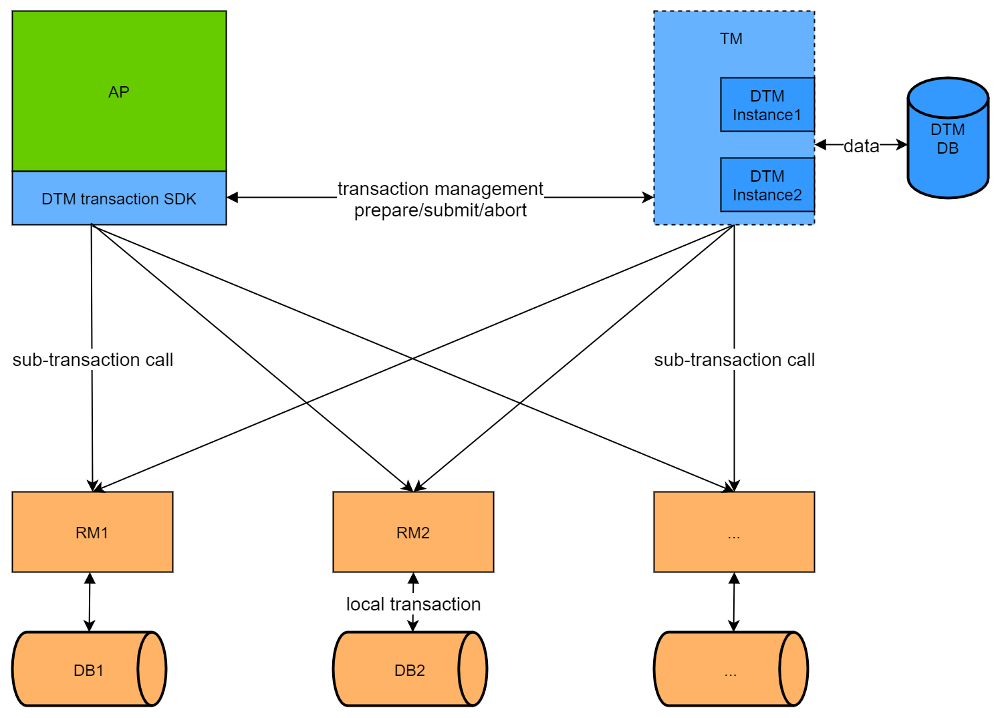

# Architecture

## Architecture and Roles

The overall architecture of dtm, which includes server and client, is shown in the following diagram.

There are three roles involved in the operation of the entire distributed transaction, similar to the OPEN/X XA transaction standard except for some differences

- RM stands for Resource Manager. 
  RM manages local transactions in distributed transactions, and is responsible for operations such as modification, commit, rollback, and compensation of related data. 
  Usually RM corresponds to a microservice.

- AP stands for Application. 
  AP registers global transactions and, according to business rules, registers sub-transactions to invoke RM via interface. 
  Usually AP corresponds to a microservice.

- TM stands for Transaction Manager. 
  Each global transaction is registered within TM, and each sub-transaction is also registered within TM. 
  TM coordinates all RMs, and commits or rolls back all the different sub-transactions that belong to the same global transaction. 
  TM corresponds to the dtm service instance.

## High Availability

Under DTM architecture, TM consists of dtm services.
Each dtm instance is a stateless application, which stores global transaction data in dtm's database. 
The whole dtm service would be naturally highly available so long as the dtm is configured with a highly available database in the actual business.

In the simple deployment model, on one hand, each dtm provides a RESTful service that accepts transaction requests from APs; on the other hand, each dtm also starts a concurrent process that regularly queries for global transactions that timed out and need to be processed, and retries transaction branches whose status was uncertain after previous execution.

## Nested sub-transactions

The TCC transaction mode of dtm supports nesting of sub-transactions, exemplified in the following flowchart:

In this flowchart, the Order microservice is responsible for the order-related data modification and also manages a nested sub-transaction.
Therefore, it plays the role of RM and AP.

